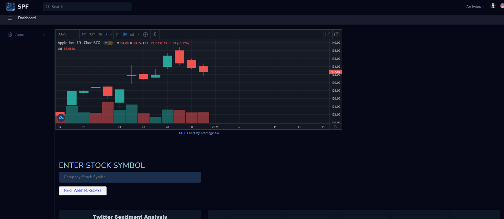
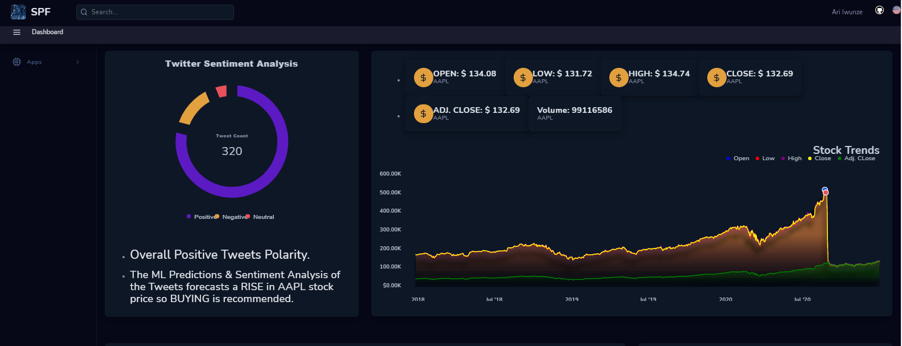
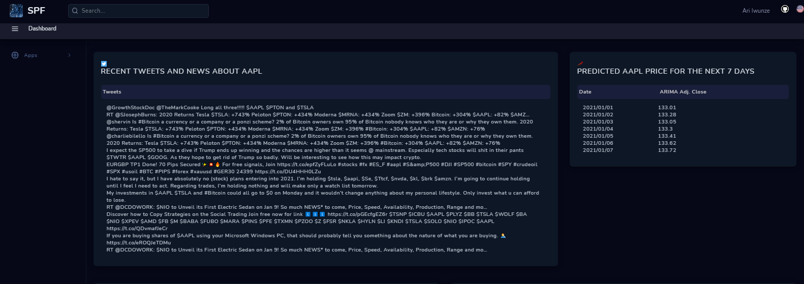
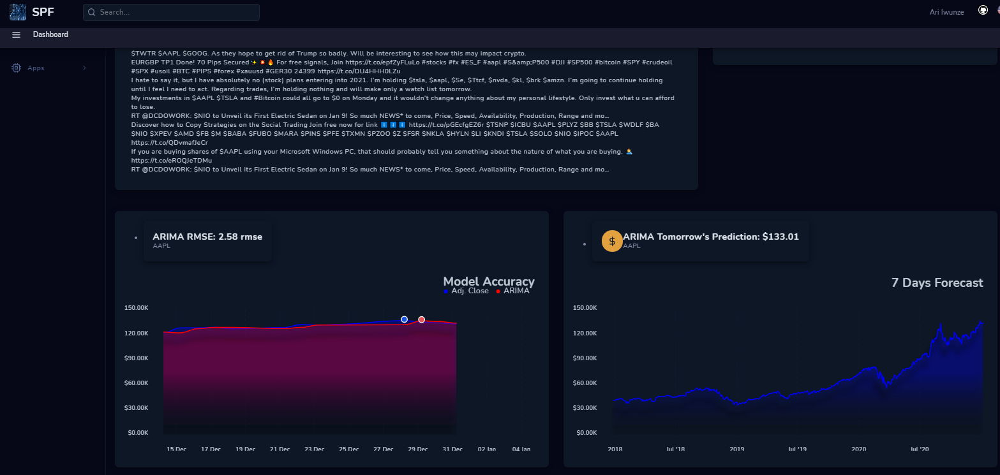
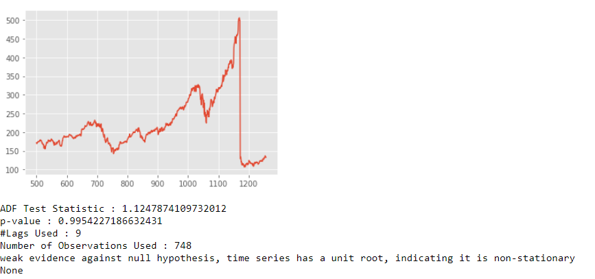
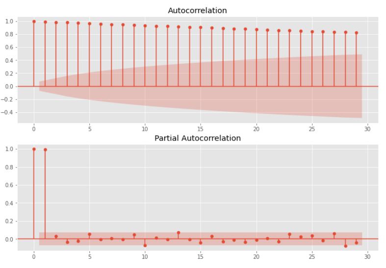
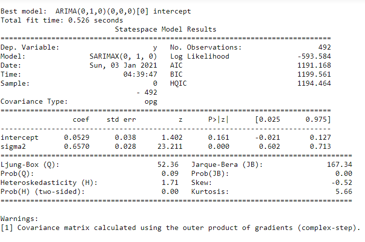
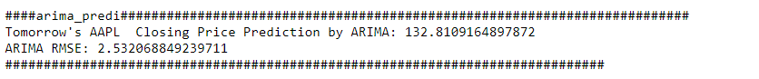
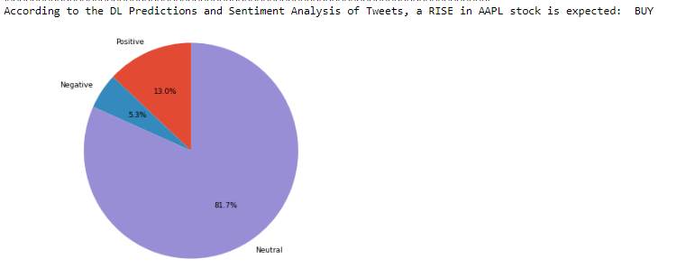

# Stock Price Forecasting Flask Web App

### Predicting Appple's Adj. Close Price For The Next 7 Days 
### WEB APP - https://davinciai.dev/forecaster

 # Table Of Contents
* [Purpose](#purpose)
* [Data Description](#data-description)
* [Model](#model)
* [Covid-19 Models Results](#results)
* [Recommendation](#recommendation)
* [Web App Features](#web-app-features)
* [Web App Structure](#web-app-structure)
* [Setup](#setup)
* [Configuration](#configuration)
* [Future Work](#future-work)
  
 ## Preview
  
  
  
  
  
## Purpose
The purpose of this research is to build a model that can efficiently predict a company's Adj. Close price for the next 7 days.

## Data Description
For this research, I used the Apple's historical stock data extracted from Yahoo Finance: 
* https://finance.yahoo.com/q/hp?s=YHOO

## Model
Firstly, I loaded the specific Apple (AAPL) dataset from yahoo finance. This dataset is composed of 12 different features but I just used the Adj. Close price column since that's what I'm going to be forecasting using the ARMA model. Next step is to test for stationarity but given that this is a stock data, its highly likely that it's not going to be stationary. This is because stock prices usually increase over time. So given its not stationary, the mean of the data increases over time which might ultimately lead to a degradation of the model. 
To test if the data is stationary, I used the Augmented Dickey-Fuller Test. As we can see, the p-value is larger than the significance level of 0.05 so I will accept the null hypothesis which is that the data is non-stationary. 
  
  
  
  
## [Results](./arima_and_nlp.ipynb)
Next, I created ACF and PACF plots to determine the p and q input parameters for our ARIMA model. From the plots, 1 and 2 seems to be a good values for p and q respectively but I'll still run an autoarima model to be sure I utilize the most optimal parameters. I then went on into fitting the model in train half of the data using 0 as my p and q parameters gotten from running the autoarima model with 1 as my order of differencing. After validating the model with test results, my root mean square error is 2.5 rmse which is not too bad. 
    
  
    
  

### Recommendation
* 0 seems to be the best parameters for p and q with 1 as the order of differencing to use when forecasting AAPL stock dataset but I recommend using an autoarima model to be sure the best parameters are picked before fitting in the training data.

## Setup
- Install the requirements and setup the development environment.

	`pip3 install -r requirements.txt`
	`make install && make dev`

- Run the application.

		`python3 main.py`

- Navigate to `localhost:5000`.

## Future Work
   * Use a simple LSTM model to forecast 7 days out then do the same with a Multivariate LSTM model. 
